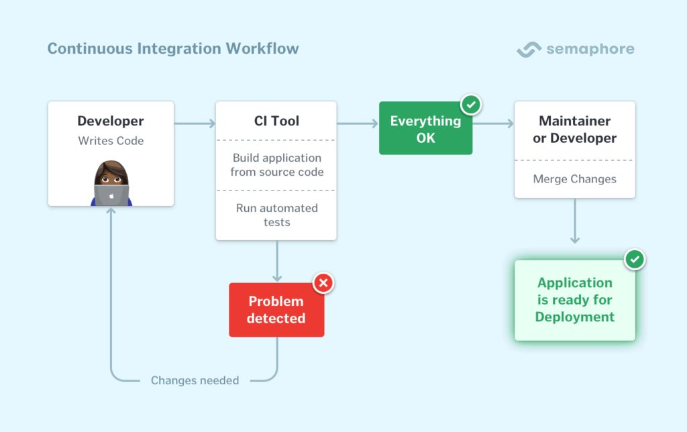

# De Eerste Stappen naar Geautomatiseerde Deployments: Een Simpele Webapplicatie Uitrollen met Jenkins en Kubernetes (Windows)

# 1. Inleiding

# 2. CI/CD-basics
Continuous Integration (CI) en Continuous Deployment (CD) vormen de ruggengraat van moderne softwareontwikkelingspraktijken die gericht zijn op het versnellen van het leveringsproces, het verbeteren van de codekwaliteit en het vergemakkelijken van het onderhoud. Hier volgt een gedetailleerde uitleg van deze concepten:
## 2.1. Continuous Integration (CI)
Continuous Integration (CI) is een ontwikkelingspraktijk waarbij ontwikkelaars hun code regelmatig, vaak meerdere keren per dag, integreren in een gedeeld versiebeheersysteem. Dit systeem voert dan automatisch een reeks tests uit om ervoor te zorgen dat de nieuwe code geen bugs introduceert en goed integreert met de bestaande codebase (Zie [Figuur 1: CI-Workflow](#figuur-1)).

**Voordelen van CI:**
- Vroegtijdige detectie van integratieproblemen en bugs.
- Vermindering van integratieproblemen, wat resulteert in een snellere softwarelevering.
- Continue feedback naar ontwikkelaars over de status van hun code.

_Figuur 1: CI-Workflow_
## 2.2. Continuous Deployment (CD)
Continuous Deployment (CD) bouwt voort op CI en gaat over het automatisch uitrollen van geïntegreerde code naar productie, zonder menselijke tussenkomst, zodra de code de kwaliteitscontroles heeft doorstaan (Zie [Figuur 2: CD-Workflow](#figuur-2)).

**Voordelen van CD:**
- Snellere levering van nieuwe functies en bugfixes aan gebruikers.
- Minder handmatige interventie en minder kans op menselijke fouten.
- Snellere feedback van gebruikers, wat helpt bij het iteratieve ontwikkelingsproces.

_Figuur 2: CD-Workflow_

Door CI en CD te combineren in een CI/CD-pipeline, kunnen ontwikkelteams een gestroomlijnd proces creëren voor het snel en betrouwbaar leveren van software, van ontwikkeling tot productie. Voor verdere inzichten in dit onderwerp, raden we aan de blogpost 'Continuous Integration (CI) Explained' van Semaphore (geschreven door Marko Anastasov) te lezen. Semaphore wordt veel gebruikt, zelfs door bekende bedrijven zoals Google en Microsoft.

# 3. Introductie tot Jenkins
Jenkins is een open-source automation server die een cruciale rol speelt in de realisatie van Continuous Integration (CI) en Continuous Deployment (CD) in moderne softwareontwikkelingsprocessen. In dit hoofdstuk verkennen we de kernaspecten van Jenkins en waarom het een voorkeurstool is voor CI/CD.
## 3.1. Kernfuncties van Jenkins
**Jenkins biedt enkele kernfuncties:**
- **Automation**: Jenkins biedt een geautomatiseerde aanpak voor het bouwen, testen en deployen van code, wat essentieel is voor het versnellen van de ontwikkelingscycli.
- **Plugin Architectuur**: Dankzij een uitgebreide reeks plugins kan Jenkins op maat worden gemaakt om aan diverse projectbehoeften te voldoen.
- **Monitoring en Feedback**: Het biedt voortdurende monitoring van projecten en geeft real-time feedback, wat helpt bij het vroegtijdig identificeren en oplossen van problemen.

**Voor- en nadelen (Zie tabel 1):**

| Voordeel | Nadeel |
|---|---|
| **Automatisering** | Kan complex zijn in te stellen |
| **Plugin-architectuur** | Kan leiden tot een onoverzichtelijke configuratie |
| **Monitoring en feedback** | Kan resource-intensief zijn |
| **Integratie met andere tools** | Kan complex zijn |
_Tabel 1: Voor en Nadelen Jenkins_
## 3.2. Werking van Jenkins
Jenkins haalt de broncode op uit een version control system zoals Git, voert build- en testtaken uit, en rapporteert de resultaten aan het team. Dit zorgt voor een snelle feedbackloop en helpt teams om een hoge codekwaliteit te handhaven (Zie Figuur 3: Jenkins workflow).

_Figuur 3: Jenkins workflow_
## 3.3. Integratie met Andere tools
Jenkins integreert naadloos met andere tools in het CI/CD-ecosysteem zoals Git voor version control en Kubernetes voor container orchestration, waardoor het een centrale spil vormt in de automatisering van software delivery processen.

# 4. Jenkins en Kubernetes: Een Perfecte Match
Jenkins en Kubernetes zijn krachtige tools die, wanneer gecombineerd, een robuuste en efficiënte CI/CD-pipeline kunnen creëren. De synergie tussen Jenkins' automatiseringsvermogen en Kubernetes' containerorkestratie maakt een gestroomlijnde workflow mogelijk voor het bouwen, testen en uitrollen van applicaties.
## 4.1. Waarom de Combinatie?
Het combineren van Jenkins en Kubernetes levert een aantal voordelen op. Kubernetes, een platform voor containerorkestratie, faciliteert het beheer, de inzet en de schaling van containerized applicaties. Aan de andere kant, Jenkins, een open-source automatiseringsserver, is uitstekend in het automatiseren van het bouwen en testen van code.

_Figuur 4: Jenkins-Kubernetes-Integratie_
## 4.2. De Integratie
De integratie van Jenkins met Kubernetes kan op verschillende manieren worden bereikt. Een veelgebruikte methode is door Jenkins-pipelines te configureren die draaien als pods in het Kubernetes-cluster. Hierdoor kunnen bouw- en testprocessen profiteren van de schaalbaarheid en veerkracht van Kubernetes.
## 4.3. Voordelen
De samensmelting van Jenkins en Kubernetes biedt vele voordelen:
- **Efficiëntie**: Door bouw- en testprocessen te automatiseren, wordt de tijd van code naar productie aanzienlijk verkort.
- **Schaalbaarheid**: Kubernetes’ vermogen om op aanvraag te schalen, gecombineerd met Jenkins’ pipeline-automatisering, maakt het gemakkelijker om met grotere codebases en teams te werken.
- **Betrouwbaarheid**: De veerkrachtige aard van Kubernetes zorgt voor een hoge beschikbaarheid en failover-capaciteiten, wat cruciaal is voor CI/CD-pipelines.

De volgende sectie zal dieper ingaan op het opzetten van een omgeving om deze geïntegreerde CI/CD-pipeline te faciliteren.

# 5. Omgeving opzetten
Dit hoofdstuk richt zich op het opzetten van de ontwikkelomgeving met behulp van twee belangrijke tools: Jenkins voor automatisering en Kubernetes voor containerorkestratie.

Voordat we beginnen, gaan we ervan uit dat je Java Development Kit (JDK) hebt geïnstalleerd, tot en met versie 17. Als dat nog niet het geval is, installeer het dan voordat je verdergaat.
## 5.1. Jenkins opzetten
De eerste stap is het installeren van Jenkins. Download het installatiebestand van de [officiële website](https://www.jenkins.io/download/).
**Stap 1, Installatie:** Voer het gedownloade `.exe`-bestand uit en volg de instructies van de installatiewizard.
**Stap 2, Basisconfiguratie:** installatie, open een webbrowser en ga naar `http://localhost:8080` om de configuratiewizard van Jenkins te starten. Nu heb je als het goed is toegang tot het plugin-beheerscherm. Installeer de aanbevolen plugins.
**Stap 3, Maak je eerste gebruiker aan:** Maak een admin-gebruiker aan. Dit zal de eerste gebruiker zijn die volledige toegang tot Jenkins heeft.
**Stap 4, URL Instellen:** Stel de URL in waar Jenkins bereikbaar is. Dit is belangrijk voor diverse integraties en webhooks.

## 5.2. Kubernetes opzetten met Docker Desktop
Kubernetes is het orkestratieplatform dat we gaan gebruiken. We maken het onszelf makkelijk door Kubernetes in te schakelen via Docker Desktop.
### 5.2.1. Docker Desktop installeren
Download en installeer Docker Desktop van de [officiële website](https://docs.docker.com/desktop/install/windows-install/).
### 5.2.2. Kubernetes inschakelen
Ga naar de Docker Desktop instellingen en schakel Kubernetes in.
#### 5.2.2.1. Installatie verifiëren
Gebruik de command line om te controleren of Kubernetes correct is geïnstalleerd. Dit kan gedaan worden met de command `kubectl cluster-info`.
### 5.2.3. Integratie met Jenkins
In een later hoofdstuk gaan we dieper in op de integratie tussen Jenkins en Kubernetes.
# Bronnenlijst

Anastasov, M.. (2023, 10, 4). Continuous Integration (CI) Explained. Semaphore. Geraadpleegd op 2023-10-05. URL: https://semaphoreci.com/continuous-integration